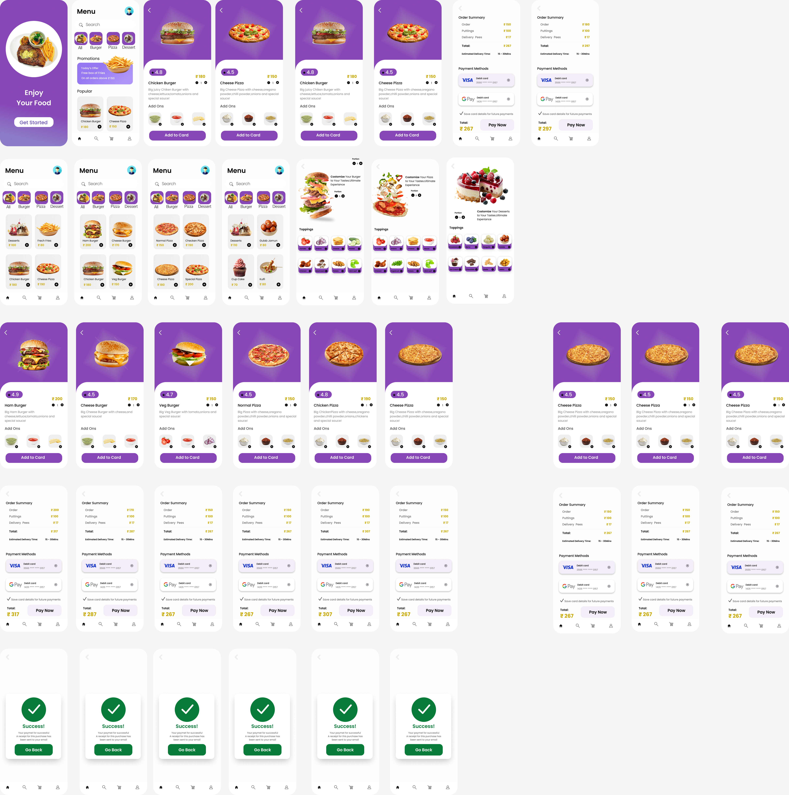

# 🍔 Food Ordering App - Figma Prototype Clone

A pixel-perfect, interactive web application clone built from the Figma Community Food Ordering App prototype design ([Figma Prototype File](https://www.figma.com/community/file/1688472582874740748/food-ordering-app)).

---

## 🎨 Figma Design Export



---

## ✨ Features

- **📱 Figma Prototype Phone Shell View**: View the app inside an interactive mobile prototype shell frame or switch to full responsive desktop mode.
- **🎨 Vibrant Purple Design System**: Custom luxury CSS styling matching Figma's exact purple gradient palette (`#7C3AED`, `#6B21A8`), glowing cards, and smooth micro-interactions.
- **👋 Welcome / Splash Screen**: Hero visual with "Enjoy Your Food" headline and "Get Started" CTA.
- **🔍 Menu & Category Filter**: Live instant search across food items with categories (`All`, `Burger`, `Pizza`, `Dessert`).
- **🎁 Promotional Offer Banner**: "Free box of Fries on all orders above ₹150" offer banner with claim button.
- **🍔 Product Detail & Customizer Sheet**:
  - Interactive portion size selector (Small, Medium, Large).
  - Custom Add-ons & Toppings selector (Jalapeño, Extra Cheese, Special Mayo, Tomatoes, Mushrooms, Crispy Onion) with live price calculation.
- **🛒 Order Summary & Checkout**:
  - Cart item management with quantity adjustments.
  - Price breakdown (Subtotal, Add-ons, ₹17 Delivery Fee, Total).
  - Estimated delivery time notice (`15 - 30 Mins`).
  - Selectable Payment Methods (VISA Debit Card `3566 **** **** 0157`, GPay `1426 **** **** 0157`, UPI, COD).
  - Save card details checkbox.
- **🎉 Order Success Screen**: Animated green checkmark modal with celebratory confetti and receipt notice.
- **🚚 Live Order Tracking**: Visual progress timeline (Order Confirmed -> Preparing -> Out for Delivery -> Delivered) with delivery partner details.
- **🌙 Dark / Light Theme Support**: Instant theme toggle for daytime and night-mode viewing.

---

## 🚀 Getting Started

### Prerequisites
- [Node.js](https://nodejs.org/) (v16 or higher)
- [npm](https://www.npmjs.com/)

### Installation

1. Clone the repository:
```bash
git clone https://github.com/thahirahamed33-tech/Clone-Food-Ordering-App---Figma.git
cd Clone-Food-Ordering-App---Figma
```

2. Install dependencies:
```bash
npm install
```

3. Start the development server:
```bash
npm run dev
```

4. Open `http://localhost:3000` in your browser.

---

## 🛠️ Tech Stack

- **Frontend Framework**: React 18
- **Build Tool**: Vite
- **Icons**: Lucide React
- **Celebration Effects**: Canvas Confetti
- **Styling**: Vanilla CSS (Custom Tokens, CSS Variables, Glassmorphism & Animations)

---

## 📂 Project Structure

```
├── public/
│   ├── figma_design.png        # Design screenshot asset
│   └── hero_food_plate.jpg     # Generated high-res hero asset
├── src/
│   ├── components/
│   │   ├── Header.jsx          # Top bar with user profile & theme toggle
│   │   ├── WelcomeScreen.jsx   # Figma splash landing screen
│   │   ├── HomeScreen.jsx      # Menu search, categories & promo banner
│   │   ├── FoodCard.jsx        # Food item cards with ratings & quick-add
│   │   ├── ProductDetailModal.jsx # Product sheet with toppings & portion sizes
│   │   ├── CartScreen.jsx      # Order summary & payment methods
│   │   ├── OrderSuccessModal.jsx  # Animated success screen
│   │   ├── OrderTrackingScreen.jsx # Live delivery progress tracker
│   │   ├── ProfileScreen.jsx   # User profile, saved address & history
│   │   └── Navbar.jsx          # Bottom navigation bar
│   ├── data/
│   │   └── foodData.js         # Food items database matching Figma design
│   ├── App.jsx                 # Prototype shell & state management
│   ├── index.css               # Design system & CSS variables
│   └── main.jsx                # Application entry point
├── figma_prototype_design.png  # Clean-named Figma prototype design image
├── Food Ordering App.png       # Original Figma export reference
└── package.json
```

---

## 📄 License

MIT License - feel free to use and modify for learning and showcase projects!
